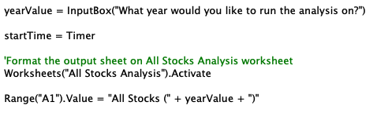
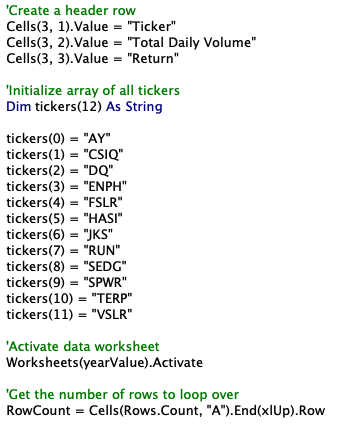
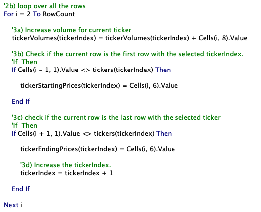
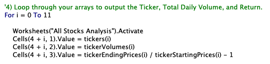
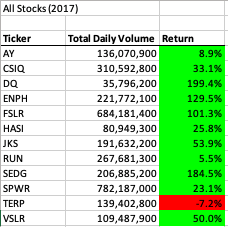
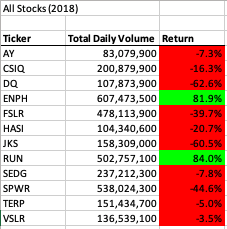
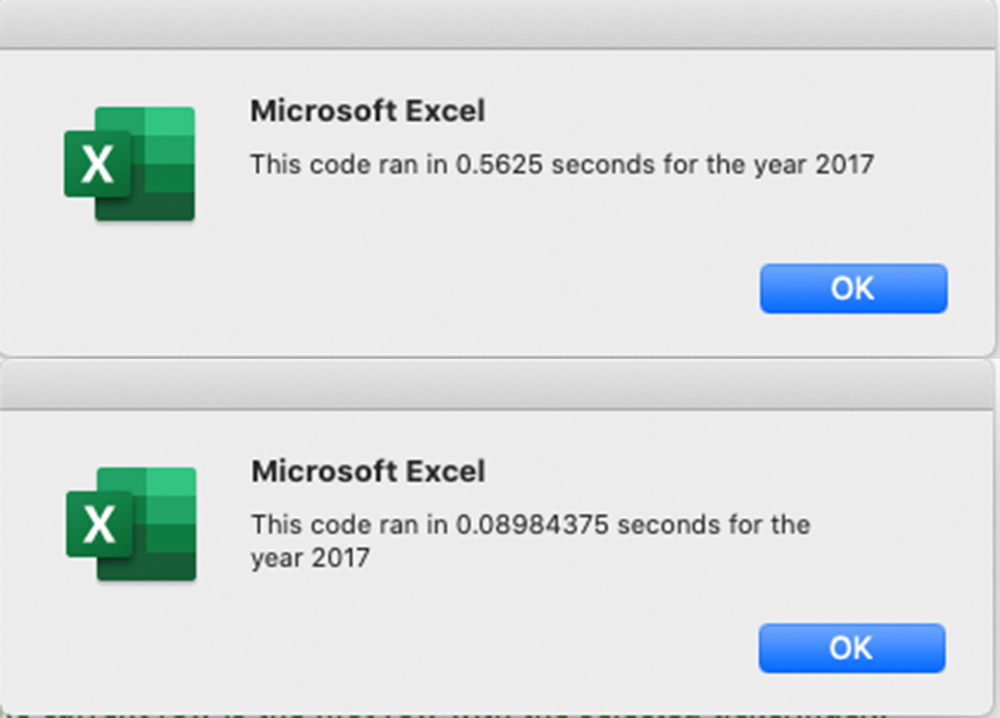
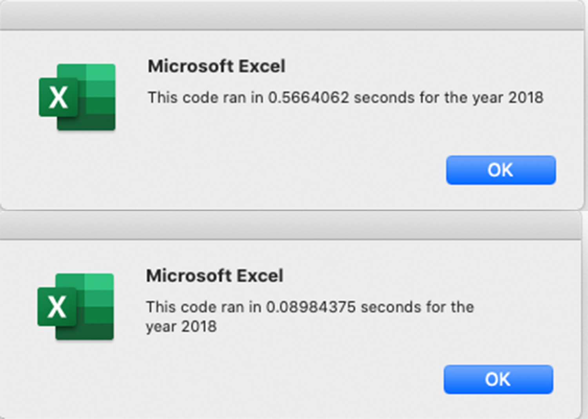
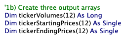
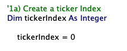

# **Stock Analysis**

## **1. Overview of the Project**

Given their passion for green energy, Steve's parents decided to invest all their money into DAQO New Energy Corp ("DQ"), a decision based solely on the fact that they met at Dairy Queen.  Call it fate? Steve is unsure and is looking to analyze other stocks to help diversify his parent's portfolio.  

We already prepared a workbook that allowed him to analyze a number of green energy stocks but here we will help broaden his research by **refactoring** the existing code.  [VBA_Challenge.xlsm](VBA_Challenge.xlsm)  

## **2. Results**

### **Comparing the stock performance between 2017 and 2018**

- Setting up code for analysis:

    - Instead of examining just one year of stock performance, we can do a more comprehensive analysis by comparing stock performance year by year.  We achieved this by creating an *InputBox* where we can simply type in the year we are looking to analyze.  

    

    - The given dataset provides information for 12 green energy stocks for 2017 and 2018.  To provide a thorough analysis for Steve's parents, we set up our code to review all stocks in the dataset, not just DQ.  The code avoided **magic numbers** in our iterator and made sure to loop over all the data to get the results for *Total Daily Volume* and *Return*.  Examples of some of the code created are as below:  

        - Created a header row, initialized array for all 12 tickers and created the variable *RowCount* to avoid hard-code numbers for the iterator incase Steve wants to expand the dataset at a later time.

        

        - Created a *for* loop to loop over all the rows.  Inside this loop, we utilized the *If-Then* statement conditional to increase the volume of the ticker under review.  This was done by setting *tickerIndex* as the index. 

        

        - Utilized a *for* loop to loop through all the arrays and show the results for *Total Daily Volume* and *Return*.

        

- Stock performance analysis:

    - Overall, green energy stocks did very well in 2017. With the exception of stock TERP, all companies under analysis showed a positive return for this year.  DQ especially outperformed all others with a +199.4% return.  Therefore, if we based our analysis solely on 2017 stock return performance, Steve's parents made the right decision by choosing DQ.  

    - However, DQ had the lowest total daily volume which could pose a liquidity risk. With this additional information, Steve's parents should look beyond DQ to diversify their portfolio to include stocks with higher volumes and positive returns such as ENPH, FSLR, SEDG and SPWR.

    

    - These stellar returns however did not continue on to 2018.  Majority of these stocks showed a negative return with DQ nosediving to a -62.6% return even though its total daily volume increased.  With such a swing in return, we would recommend Steve's parents to not buy into this volatile DQ stock.

    - There are 2 stocks that Steve's parents should look to invest in.  ENPH did well in 2017 with high daily trading volume and a high return of +129.5%.  Even though the return dipped to +81.9% in 2018, ENPH's daily volume soared to over +600M making it a good stock to invest in.  Another healthy stock is RUN.  It not only increased its total daily volume from 2017 to 2018 but also increased its return from +5.5% to +84.0%.

    

### **Comparing the execution times of the original script and the refactored script**

- As you can see in the below comparisons of information generated from the *MsgBox*, the refactored code executed the VBA script much faster than the original.

    - 2017 original script vs refactored script
    
    

    - 2018 original script vs refactored script

    
    
## **3. Summary**

### **Advantages of refactoring code**

- There are many advantages to refactoring code.  Some of these advantages are:
    - To make it more efficient helping to make the program run faster.
    - Takes up less memory.
    - To make it easier to read in turn easier to understand.
    - To improve the bad smells to prevent future defects.
    - To help find bugs in the original code.

### **Disadvantages of refactoring code**

- Refactoring is not always a good idea.  Some of the disadvantages of refactoring code are:
    - Cost of refactoring may not make sense.  It may be more cost effective to rewrite the code from scratch or not mess with the original code.
    - If your original code is stable and working well for the project then you may not want to mess with the code by refactoring.
    - There is a tight deadline for the project. There may not be enough time for refactoring so the return on investment may not make sense.  Additionally, it may introduce bugs with little or no time to test for.

### **How these pros and cons apply to refactoring the original VBA script**

- Pros to refactoring the original VBA script:
    - The refactored code is more efficient as we edited the original code to take fewer steps and improved on the logic. For example, instead of just initializing the variables for the starting price and ending price, we combined steps by initializing the volumes, starting prices and ending prices variable by creating these as output arrays.  

    

    - As shown above in Section 2 (code 2b), we also refactored by creating one *for* loop to generate the ticker volume and the starting and ending price differences for the returns output.  

    - With refactoring the original VBA script, if the dataset were to be expanded, the refactored script will still work whereas the original script won't, hence preventing any future defects.  This was done by creating a *tickerIndex* index in the refactored code which allows for Steve to expand on his dataset to the entire stock market instead of limiting it to the current 12 green energy stocks. 

    

    - The refactored code also executed much faster than the original code as shown in the execution time images above.  This faster execution time will be very useful if the project is expanded to include thousands of stocks.

- Cons to refactoring the original VBA script:
    - If Steve had a set budget for this project, it would be an additional cost to do the refactoring.  Since his parents were only interested in green energy stocks, there will be limited return on investment from refactoring as he is looking to analyze just the energy stocks, not the whole stock market.

    - If Steve needed to utilize this script as soon as possible in order to give his recommendation to his parents, we should go live with the original script.  The original script still achieves the analysis he is looking for and with a tight deadline we would not have sufficient time to go through the refactoring process and check for bugs to provide him with a better script.
    